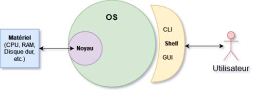
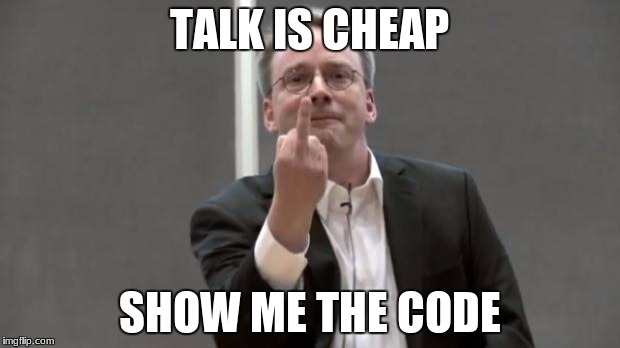
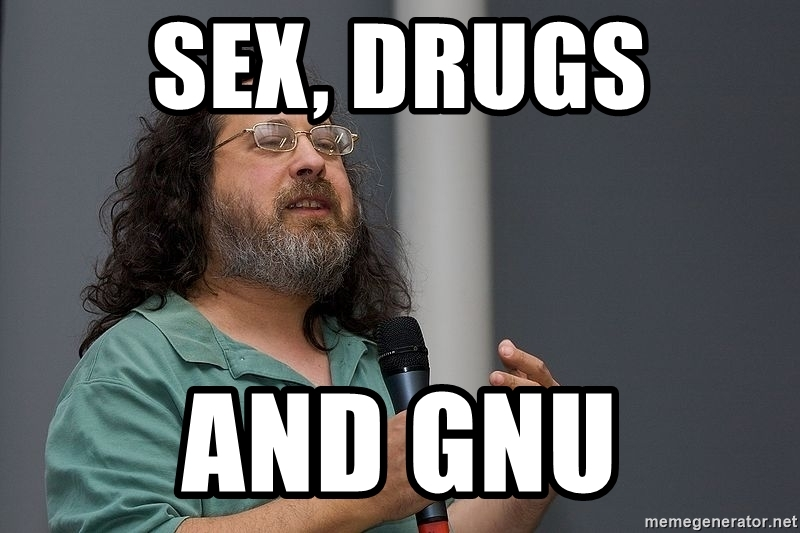
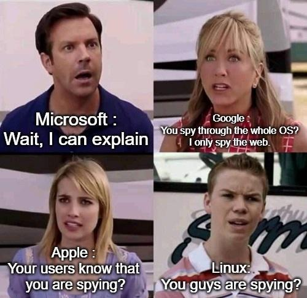

# Intro Linux

Petite introduction sur :

- la notion d'OS et de noyau
- Linux
- les notions de libre et opensource

## Sommaire

- [Intro Linux](#intro-linux)
  - [Sommaire](#sommaire)
- [I. Notion de noyau et d'OS](#i-notion-de-noyau-et-dos)
  - [1. La place du noyau](#1-la-place-du-noyau)
  - [2. L'OS et le shell](#2-los-et-le-shell)
  - [3. Le terminal](#3-le-terminal)
- [II. Linux](#ii-linux)
  - [1. Intro](#1-intro)
  - [2. GNU](#2-gnu)
    - [A. UNIX](#a-unix)
    - [B. Libre et Open-Source](#b-libre-et-open-source)
  - [3. Résumé](#3-résumé)

# I. Notion de noyau et d'OS

## 1. La place du noyau

Le noyau ou *kernel* en anglais, est une application. Il est l'application qui a la charge de communiquer avec le matériel.

> Plus précisément, le noyau a à sa disposition des pilotes ou *drivers*. Les pilotes sont aussi des applications. Un pilote a la charge d'interpréter les signaux physiques qu'il reçoit d'un périphérique spécifique. Le *kernel* utilise donc souvent de multiples *pilotes* en même temps pour que tout le matériel fonctionne.

Le noyau est souvent livré avec l'OS, voire complètement intégré à l'OS.

> Ces notions générales autour du noyau, de l'OS et du shell sont valables pour tous les OS, pas seulement les OS GNU/Linux.

## 2. L'OS et le shell

**L'OS** (pour *operating system* ou *système d'exploitation* en français) **est un programme lui aussi**, ou plutôt, un ensemble de programmes.

> Tous ces mots désignent la même chose : programme, application, logiciel, *software* voire même "outil".

L'OS un ensemble de programmes qui se sert des fonctionnalités du noyau pour proposer quelque chose d'utile pour les humains.

Il a pour principale tâche de vous donner un environnement où, en tant qu'humain, vous pouvez faire des bails.  
Du genre exécuter de nouveaux programmes (navigateur web, IDE, lecteur vidéo, etc.) qui profitent du matériel pour s'exécuter et vous en faire profiter.

> Il fait d'autres trucs aussi l'OS, genre faire en sorte que votre machine reste à l'heure, ou génère des fichiers de logs s'il y a des soucis, etc.

L'OS est fourni avec au moins un shell : c'est la partie de l'OS qui est directement utilisable.  
Il existe deux types de shell :

- ***GUI*** pour *Graphical User Interface*
  - c'est l'aspect graphique, avec une souris, un Bureau, des fenêtres, etc.
  - ce qu'on utilise au quoitidien
- ***CLI*** pour *Command Line Interface*
  - c'est le terminal
  - par abus de langage, on  utilise les mots *shell* et *terminal* de façon interchangeable

> *Shell* c'est coquille en anglais. La coquille autour de l'OS.

## 3. Le terminal

Parlons-en sur quelques lignes.

Le *terminal*, qui est donc l'interface *CLI* est encore utilisée de nos jours, bien plus que les *GUI* par les techniciens en informatique.

> Que ce soit développeur, adminsys, admin réseau, je parle même pas de quelqu'un qui fait de la sécu, la ligne de commande va devenir une seconde nature. Plus tôt c'est et mieux c'est hihi.

**Si on utilise le terminal, très souvent, c'est parce que c'est outil extrêment efficace, et qu'il n'a rien de dépassé.**  

> On ne l'utiliserait pas si c'était chiant à utiliser. On est en 2021 meow.

Au contraire, les terminaux aujourd'hui, pour certains, sont très modernes et possèdent des fonctionnalités très avancées ([ou juste absurdes](https://opensource.com/article/18/12/linux-toy-youtube-dl)) pour en faciliter l'usage.

Vous apprendrez petit à petit à vous familiariser avec. Comme on l'a dit en cours, n'y voyez rien de magique ou de mystique, **le terminal est un bête explorateur de fichier.**

**Ce n'est pas une image ou métaphore, le terminal EST un explorateur de fichier**. C'est juste qu'on utilise le clavier au lieu de la souris.

> La différence entre *shell* et *terminal* est en vérité un poil plus subtil que ça, mais on y reviendra ptet.

# II. Linux

## 1. Intro

**Linux est le noyau des systèmes d'exploitation GNU/Linux.**  
Comme dit dans la section précédente, c'est lui qui a la tâche d'interagir avec le matériel.

Par abus de langage, on dit qu'on utilise un "OS Linux", mais on devrait parler plutôt d'OS GNU/Linux.

GNU constitue une partie importante de l'OS, alors que Linux n'a que le rôle de noyau.

Le noyau Linux a été développé par Linus Torvalds en 1991.

> [Linus Torvalds est aussi l'inventeur et développeur de `git`.](https://www.youtube.com/watch?v=4XpnKHJAok8)

> Linus Torvalds sur la photo c:

## 2. GNU

*GNU* est un projet qui vise à développer des outils afin de constituer un OS complet.

*GNU* est l'acronyme de *GNU's not UNIX*. Pour comprendre un peu cette expression, on va remonter un peu le temps.

### A. UNIX

Dans les années 1970, AT&T développe un système d'exploitation complet : *UNIX*. Il est très vite largement adopté et utilsé à grande échelle, et atteint son apogée dans les années 80.

Ce système, bien que parfaitement fonctionnel, souffre, selon certains utilisateurs, d'un cruel défaut : il n'est pas assez personnalisable.

On ne peut pas assez *plier* *UNIX* pour en faire ce qu'on veut.

C'est l'idée fondatrice du projet *GNU* : crée un système qui ressemble à *UNIX*, car c'est un système cohérent, qui a fait ses preuves, mais qui est facilement pliable pour s'adapter à plus de situations.

> Alors que le projet *GNU* avançait de bon train, une pièce maîtresse manquait à l'édifice : le noyau. Le noyau, l'application la plus critique de l'OS, a la lourde tâche d'interagir avec le matériel. C'est Linux Torvalds qui viendra combler le puzzle comme dit plus haut, en 1991.

Richard Stallman est l'intiateur du projet *GNU*, et c'est aussi lui qui a initié la philosophie du *libre*.

> C'est Stallman sur la photo c:

### B. Libre et Open-Source

Le terme *open-source* désigne simplement un programme dont on livre le code source.

> Des programmes développés en C ou en Go par exemple, nécessite une *compilation*. Ainsi, le programme qui est exécuté ne contient plus le code original tel qu'il a été écrit. **Un programme en C est *open source* si on livre le code source aux utilisateurs, en plus du programme compilé.**

Le terme *libre* lui, est plus lourd de sens : il fait référence à des **licences *libres***.

> Richard Stallman parle volontiers de *copyleft* par opposition au *copyright* pour parler de cette philosophie. C'est lui qui a initié la philosophie du *libre* avec le projet *GNU*. Baboom.

[Des licenses libres, il en existe plein](https://en.wikipedia.org/wiki/Free-software_license), qui sont plus ou moins permissives, mais de façon générale, quand on parle d'un outil *libre*, on parle d'un outil :

- open-source
- qu'on a le droit de modifier
- qu'on a le droit de redistribuer
- qu'on a le droit de revendre
- **MAIS** quoiqu'on fasse avec, on doit le remettre sous la même license, c'est la seule contrainte

> On note *FOSS* ces outils pour *Free and Open-Source Software*.

## 3. Résumé

Si on résume. *GNU* + *Linux* = un OS complet.

*GNU* est un projet, qui rassemble plusieurs outils, pour créer un OS complet.  

Linux est une application, c'est un noyau de système d'exploitation.

***Une distribution GNU/Linux* est un OS complet basé sur les outils *GNU* et le noyau *Linux*.**

**Le tout est *libre* est *open-source*.**

