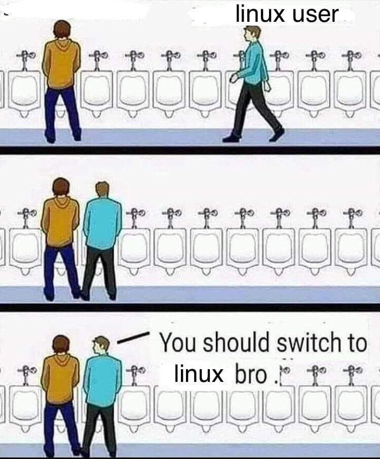

# Cours Linux

## Mémos

- [Shell et commandes](./memo/shell.md)
- [Rocky network](./memo/rocky_network.md)
- [Installation de la VM Rocky](./memo/install_vm.md)
- [Docker](./memo/docker.md)

## Dév

- [API REST HTTP avec Flask](./dev/api/README.md)

## Admin

- [Cours B1 Script](./script/README.md)
- [Cours B1 Partitionnement](./partition/README.md)

