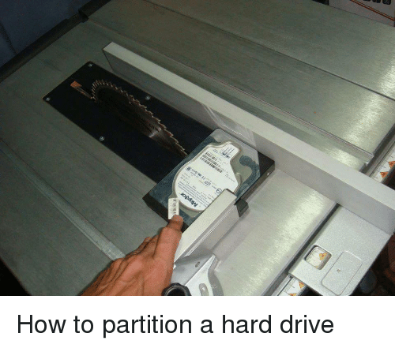
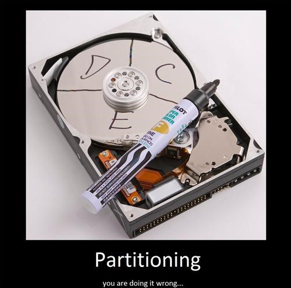

# Partitionnement

Ce document va couvrir **la notion de partitionnement**, qu'on va aborder sous plusieurs aspects :

- brève présentation
- pourquoi on partitionne
- ce qu'est concrètement le partitionnement
- comment et avec quels outils on met en place du partitionnement sous GNU/Linux

C'est un des skills très basiques de l'informaticien. Que ce soit pour administrer correctement votre propre machine, ou des serveurs.

# Sommaire

# I. Le partitionnement

➜ **Le *partitionnement* est le fait de découper l'espace d'un *périphérique de stockage* en une ou plusieurs parties.**

> Par le terme générique "*périphérique de stockage*" on désigne tous les machins qu'on branche à un PC pour stocker des données sur le long terme : disques dur (hdd, ssd), clés USB, cartes SD, CD-ROM, etc.

Une fois un périphérique de stockage partitionné, on est en mesure de *formater* chacune des partitions.

➜ **Les actions de *partitionner* puis de *formater* chacune des partitions sont strictements nécessaires** pour pouvoir utiliser *un périphérique de stockage*.

En effet, sans partition ni formatage, on ne serait en mesure de stocker uniquement des bits (des 0 et des 1) sur les périphériques de stockage.  
Grâce au partitionnement et au formatage, on est en mesure de s'abstraire du niveau binaire, et de manipuler ce qu'on appelle des *fichiers* et des *dossiers*.

Autrement dit, grâce au *formatage* puis au *partitionnement*, les 0 et les 1 stockés sur les *périphériques de stockage* sont organisés de façon cohérente pour former une *arborescence* de *fichiers* et *dossiers*.

**On partitionne donc obligatoirement le disque lorsqu'on installe un OS** (même si c'est pour faire qu'une seule grosse partition).

➜ Nous allons détailler chacun de ces termes ainsi que la logique qu'il y a derrière dans le reste du document.

## 1. Pourquoi

Commençons par expliquer pourquoi le partitionnement est nécessaire.

➜ Comme énoncé en intro, la principale raison qui rend nécessaire le partitionnement (puis le formatage) est simplement de **rendre utilisable le périphérique de stockage**.

En effet, **une fois *partitionné* (puis *formaté*), un explorateur de fichiers peut "comprendre" le *périphérique de stockage*** et permettre à un utilisateur du système de créer des *fichiers* et *dossiers* au sein d'une arborescence de fichiers.

---

Cela dit, comme souvent en informatique, un concept de ce genre (partitionner + formater) qui permet de résoudre un problème élémentaire (comment rendre les 0 et les 1 d'un périphérique intelligible pour des humains ?) aboutit sur d'autres bénéfices.

Dans le cas du partitionnement, il est désormais aussi utilisé pour :

➜ **permettre le multi-boot sur un unique périphérique**

- il est possible d'installer des OS différents au sein d'un même périphérique de stockage
- par exemple : couper un disque en 3 partitions, et installer sur chacune un OS différent
- c'est le principe du *dual-boot* dont beaucoup ont entendu parler

➜ **séparation des données**

- simplement ranger sa chambre !
- typiquement : on coupe le disque principal d'une machine en deux
  - une partition est réservée à l'installation d'un OS
  - l'autre partition stockera les données personnelles de l'utilisateur

➜ **performances**

- il est possible d'organiser de façon utile les partitions, quelques exemples :
  - on stocke l'OS et les applications sur des partitions qui reposent sur des disques SSD (car un OS et les apps demandent beaucoup d'accès disque)
  - on stocke les données personnelles (musique, films, etc) sur des disque mécaniques afin de les garder plus longtemps en sacrifiant un peur de performances (qui n'est pas nécessaire)
  - sur des disques mécaniques on stocke les données auxquelles on a besoin d'accéder souvent au centre du disque (vitesse angulaire)

➜ **sécurité**

- il y a plusieurs aspects ici à couvrir, mais nous citerons surtout l'utilisation des *options de montage*
- au moment où la partition est créée et formatée, on va pouvoir utiliser des *options* avant de la rendre vraiment utilisable
- par exemple, indiquer que la partition ne devra pas permettre l'exécution de programmes, si des programmes y sont stockés

> D'autres bénéfices pourraient être cités, nous avons vu ici que les principaux. Vous trouverez énormément de documentation en ligne sur ces sujets.

## 2. Concrètement

Booooon ok mais concrètement, ça veut dire quoi "*partitionner un disque*", "*formater une partition*" ?  
Un autre terme que nous expliquerons dans cette section est le terme "*monter*" une partition.

> Comme dit plus haut, il est nécessaire de *partitionner* (puis *formater*) n'importe quel *périphérique de stockage* avant de pouvoir l'utiliser. Pour la facilité de lecture du document nous parlerons dans la suite de ***partitionner un "disque"***, mais cela s'applique à n'importe quel *périphérique de stockage*.

### A. Partitionner

➜ **Partitionner un disque est le fait de couper ce disque en plusieurs parties.**

Un disque dur permet de stocker les informations sous format binaire (des 0 et des 1). Les bits sont regroupés usuellement par groupe de 8 qu'on appelle un octet. Chaque octet sur le disque est numéroté.

Lorsqu'on partitionne, on crée d'abord une *table de partition* sur le disque dur.

La *table de partition* c'est simplement un tableau qui indique quelles partitions se trouvent sur le disque : à quel octet commence chaque partition, et à quel octet chaque partition se termine.

> La *table de partition* est stockée sur les premiers octets du disque. Il en existe plusieurs types qui déterminent simplement la forme que prend la table. Les deux types de tables les plus utilisées sont *MBR* et *GPT*.

### B. Formater

➜ ***Formater* un disque c'est le fait de créer un *système de fichiers* sur une partition.**

Créer un *système de fichier* c'est créer au début de la partition un tableau qui contiendra les informations sur chacun des fichiers stockés sur le disque.

Ainsi ce tableau stocke, pour chaque fichier :

- l'octet de début du fichier
- l'octet de fin du fichier
- des métadonnées sur le fichier
  - son propriétaire
  - ses permissions
  - son nom
  - sa date de dernière modification
  - etc.

C'est le *système de fichiers* qui contient la correspondance entre les 0 et les 1 (stockés sur une partitions) et les fichiers/dossiers (qu'on manipule en tant qu'humains).

Lorsqu'on utilise un terminal ou un explorateur de fichiers, nous interrogeons le *système de fichiers*.

Une autre façon de le dire : **sans système de fichiers sur la partition, on ne pourrait lire que des 0 et des 1.** Sans système de fichiers, la notion de "fichiers" n'aurait pas de sens.

> Il existe différents types de fichiers qui présentent des bénéfices différents et sont natifs sous différentes plateformes. Les plus utilisés : NTFS (Windows), ext4 (GNU/Linux), btrfs (GNU/Linux), APFS (MacOS).

### C. Monter

#### C. a. Notion de montage partition

➜ **Monter une partition (préalablement *formatée*) c'est la rendre disponible et accessible au sein du système.**

L'action de *monter une partition* vient après le *formatage*. Une fois le *système de fichiers* en place sur la partition, on peut *monter la partition* afin de la rendre utilisable.

Ainsi, une fois *montée* on pourra utiliser une partition et donc y accéder, créer des *fichiers* et des *dossiers* à l'intérieur.

Une partition doit être montée sur un *point de montage*.

#### C. b. Notion de point de montage

➜ **Sur GNU/Linux et MacOS**

- un *point de montage* est un simple dossier
- on peut donc simplement utiliser la commande `mkdir` pour créer de nouveaux *points de montage*
- il n'existe qu'une seule *racine* c'est `/`
  - une partition est donc montée sur le dossier `/` c'est le strict minimum pour qu'un tel système fonctionne
  - un peu comme monter une partition `C:` est strictement nécessaire pour Windows

➜ **Sur Windows**

- les *points de montage* sont des lettres (le premier *point de montage*, celui où est accessible partition principale du système c'est `C:`)
- si d'autres partitions sont montées, elles se verront attribuer chacune une lettre
  - `D:`, puis `E:`, etc.
- chaque *point de montage* est le début d'une arborescence de fichiers, c'est une *racine*

> En effet, la question "dans quel dossier se trouve le dossier `C:` ? ou `D:` ?" n'a pas de sens : les deux sont des racines.

# II. LVM

LVM pour *Logical Volume Manager* est l'outil de référence pour partitionner des disques dans des systèmes GNU/Linux.

LVM fonctionne sur un principe simple :

- on ajoute nos disques (les volumes physiques) à la config de LVM
  - LVM les appelle *PV* pour *Physical Volume*
- on regroupe différents disques en un ou plusieurs groupes de volumes
  - LVM les appelle *VG* pour *Volume Group*
- on découpe le groupe en un ou plusieurs volumes logiques
  - LVM les appelle *LV* pour *Logical Volume*

Un [mémo dédié à LVM est dispo](../memos/lvm.md) pour les commandes qui permettent de partitionner un périphérique grâce à LVM.

# III. Résumé

➜ Partitionner un disque c'est strictement obligatoire, sinon le disque est inutilisable

➜ On partitionne pour des raisons de rangement, de sécurité ou de performances

➜ En partant d'un disque vierge, les étapes à réaliser pour pouvoir l'utiliser sont les suivantes :

- partitionner le disque
- formater chaque partition
- monter chaque partition

On sera alors en mesure d'accéder à chacune des partitions, afin d'interagir avec des fichiers et des dossiers.
